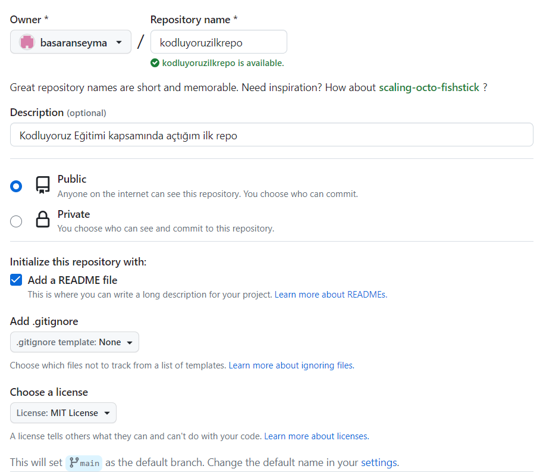

# Kodluyoruz İlk Repo

Bu repo [Kodluyoruz](https://www.kodluyoruz.org) Front-End Eğitimi'nde oluşturduğumuz ilk repo. İçerisinde bir adet README dosyası, bir adet de index.html barındırıyor.



## Installation

Öncelikle projeyi clone'layın. (Buraya sizin reponuzdan aldığınız link gelecek)

```bash
git clone https://github.com/basaranseyma/kodluyoruzilkrepo
```

## Usage

Projeyi clone'ladıktan sonra Visual Studio Code programında açınız.

Linux için:

```linux
cd kodluyoruzilkrepo
code .
```

## Contributing

Pull request'ler kabul edilir. Büyük değişiklikler için lütfen önce neyi değiştirmek istediğinizi tartışmak için bir konu açınız.

## License

[MIT](https://choosealicense.com/licenses/mit/) 
